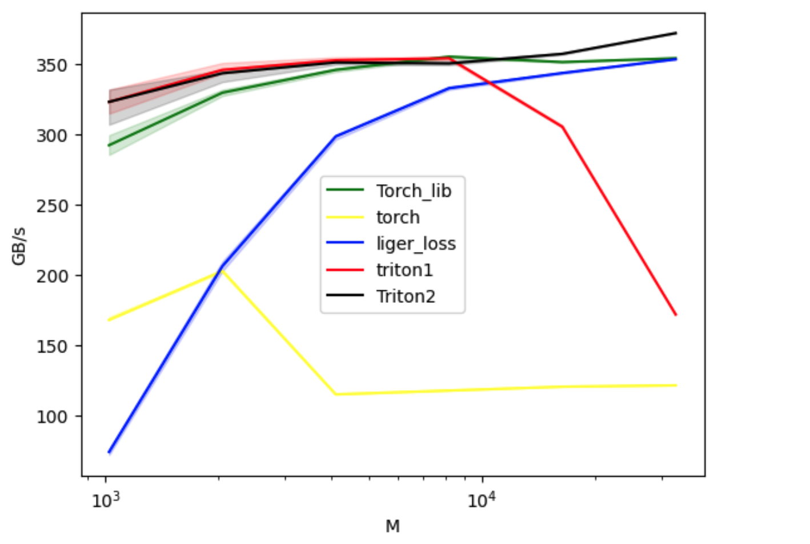
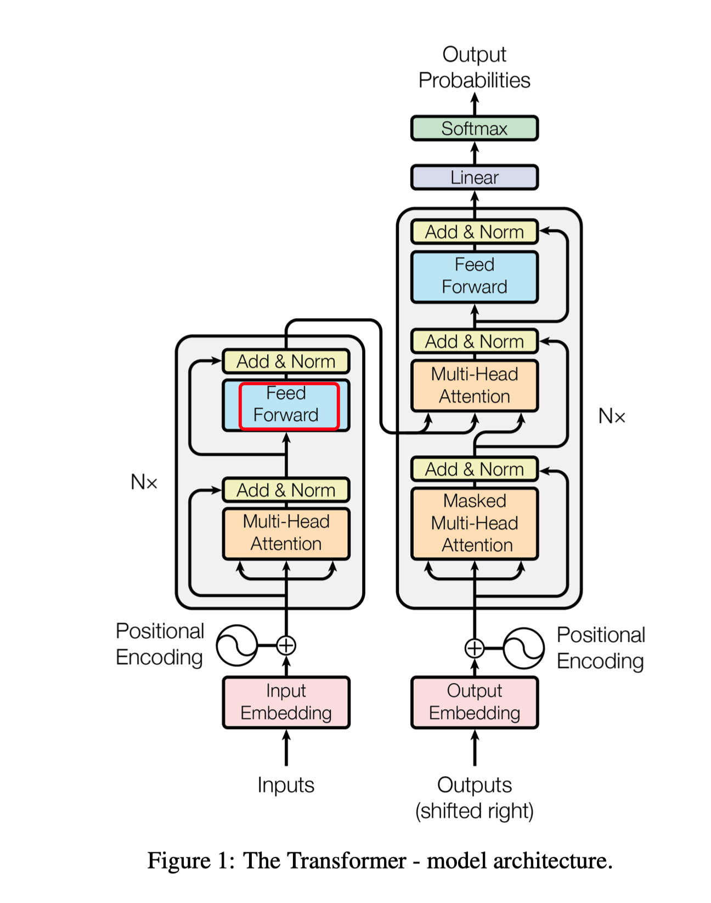

# Triton-fused-kernel

list fused kernels in transformer written by Triton

## Fast cross entropy loss

[Full detail](https://informal.top/posts/weekly-19-Triton-Liger-Kernel-cross-entropy-with-backward/#full-cross-entropy)

Performance: improve 7% than torch kernel

Difference beween black line and red line is change the block size of GPU kernel

## Fused two layer feed forward network
like this part in attention

# TODO
- [ ] ffn2: working
- [ ] ffn2 + residual + norm
- [ ] linear + softmax
